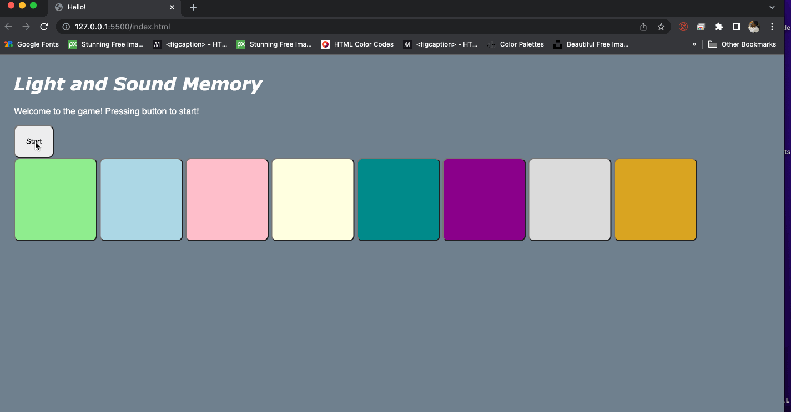

Name: Ezra Ngare

# Pre-work - *Memory Game*

**Memory Game** is a Light & Sound Memory game to apply for CodePath's SITE Program. 

Submitted by: **NAME**

Time spent: **#** hours spent in total

Link to project: (insert your link here, should start with hhttps://glitch.com/edit/#!/pacific-cosmic-arrow)

## Required Functionality

The following **required** functionality is complete:

* [X] Game interface has a heading (h1 tag), a line of body text (p tag), and four buttons that match the demo app
* [X] "Start" button toggles between "Start" and "Stop" when clicked. 
* [X] Game buttons each light up and play a sound when clicked. 
* [X] Computer plays back sequence of clues including sound and visual cue for each button
* [X] Play progresses to the next turn (the user gets the next step in the pattern) after a correct guess. 
* [X] User wins the game after guessing a complete pattern
* [X] User loses the game after an incorrect guess

The following **optional** features are implemented:

* [X] Any HTML page elements (including game buttons) has been styled differently than in the tutorial
* [X] Buttons use a pitch (frequency) other than the ones in the tutorial
* [X] More than 4 functional game buttons
* [X] Playback speeds up on each turn
* [X] Computer picks a different pattern each time the game is played
* [X] Player only loses after 3 mistakes (instead of on the first mistake)
* [ ] Game button appearance change goes beyond color (e.g. add an image)
* [ ] Game button sound is more complex than a single tone (e.g. an audio file, a chord, a sequence of multiple tones)
* [ ] User has a limited amount of time to enter their guess on each turn

The following **additional** features are implemented:

- [ ] List anything else that you can get done to improve the app!

## Video Walkthrough (GIF)

If you recorded multiple GIFs for all the implemented features, you can add them here:

## Reflection Questions
1. If you used any outside resources to help complete your submission (websites, books, people, etc) list them here. 

https://fonts.google.com, https://en.wikipedia.org/wiki/Pitch_(music), https://htmlcolorcodes.com/

2. What was a challenge you encountered in creating this submission (be specific)? How did you overcome it? (recommended 200 - 400 words) 

I took alot of time to work on the project besides having previous experience in web development. I had to learn some new concepts. I also realized that in building such a game I should come up with concepts how I will use inorder to build it before implementation. 

3. What questions about web development do you have after completing your submission? (recommended 100 - 300 words) 

What if the game, could be made with only a framework such as React, what could be the advantages?

Can I make the buttons be movable by a user to wherever he/she wants?

Is there a quicker and better way to go about making the game?

4. If you had a few more hours to work on this project, what would you spend them doing (for example: refactoring certain functions, adding additional features, etc). Be specific. (recommended 100 - 300 words) 

Building extra features was the most time-consuming part. In particular, adding syllables with varying frequencies to emulate the available pitches of real instruments. I researched a lot online and finally found the frequency of a real instrument as well as updating the frequency map and adding more buttons, I had to find additional color pairs (one light, one dark) for each of the newly added buttons. Because of my experience in mobile app design and knowledge of javascript, I'm confident in improving my web-design skills.

## Interview Recording URL Link

[My 5-minute Interview Recording](https://www.loom.com/share/7acbf96dd0c34eb89678d4cc959826c2)

## License

    Copyright [EZRA NGARE]

    Licensed under the Apache License, Version 2.0 (the "License");
    you may not use this file except in compliance with the License.
    You may obtain a copy of the License at

        http://www.apache.org/licenses/LICENSE-2.0

    Unless required by applicable law or agreed to in writing, software
    distributed under the License is distributed on an "AS IS" BASIS,
    WITHOUT WARRANTIES OR CONDITIONS OF ANY KIND, either express or implied.
    See the License for the specific language governing permissions and
    limitations under the License.

